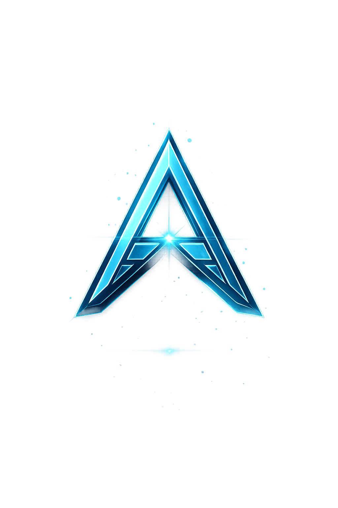

<div align="center">



# Axel Alexius Latukolan

**Web3 Analyst · Data Processing Specialist · Hospitality Professional**

[](https://www.axelal.my.id)
[](https://www.axelal.my.id)
[](#lisensi)
[](https://github.com/unknownkz/Portofolio/commits/main)

---

*Portofolio digital profesional — dibangun tanpa framework, tanpa build step.*

</div>

---

## Daftar Isi

- [Tentang](#tentang)
- [Live Preview](#live-preview)
- [Fitur Utama](#fitur-utama)
- [Teknologi](#teknologi)
- [Struktur Project](#struktur-project)
- [Menjalankan Secara Lokal](#menjalankan-secara-lokal)
- [Deploy](#deploy)
- [Cara Update PWA](#cara-update-pwa)
- [Cara Update Icon App](#cara-update-icon-app)
- [Kontribusi](#kontribusi)
- [Lisensi](#lisensi)

---

## Tentang

Repository ini berisi source code website portofolio digital milik **Axel Alexius Latukolan** — menampilkan pengalaman kerja, keahlian teknis, dan informasi kontak secara profesional.

Dibangun dengan **pure HTML, CSS, dan JavaScript** (tanpa framework), dengan fokus pada performa, aksesibilitas, dan pengalaman pengguna yang modern. Website mendukung PWA sehingga bisa diinstall sebagai aplikasi di perangkat mobile maupun desktop.

---

## Live Preview

🌐 **[www.axelal.my.id](https://www.axelal.my.id)**

---

## Fitur Utama

| Fitur | Deskripsi |
|---|---|
| 🎨 **Animated UI** | Particle canvas, custom cursor, parallax, orbit logo, typing effect |
| 🌗 **Dark / Light Mode** | Toggle tema dengan preferensi tersimpan di localStorage |
| 🌐 **Bilingual (ID / EN)** | Seluruh konten beralih bahasa secara dinamis tanpa reload |
| 📱 **Responsive** | Tampilan optimal dari mobile 320px hingga desktop 4K |
| ⚡ **PWA Ready** | Installable, offline support via Service Worker, auto-update system |
| 🔔 **Auto Update Toast** | Notifikasi versi baru muncul otomatis saat deploy — bilingual |
| 🔄 **Reinstall Detection** | Toast khusus saat icon/nama app berubah — panduan reinstall otomatis |
| 🔒 **Security Headers** | CSP, HSTS, X-Frame-Options, CORP, COOP via Vercel |
| 🛡️ **Content Protection** | Blokir klik kanan, drag gambar, DevTools shortcut |
| 🔍 **SEO Optimized** | Open Graph, Twitter Card, sitemap.xml, robots.txt, canonical URL |
| ♿ **Accessible** | ARIA labels, role attributes, `aria-live`, keyboard navigation |

---

## Teknologi

```
Frontend
├── HTML5              Semantic markup, ARIA accessibility
├── CSS3               Design tokens, glassmorphism, CSS variables, keyframes
└── JavaScript ES6+    Module pattern, IntersectionObserver, Web APIs

PWA & Performance
├── Service Worker     Cache-First + Network-First, auto-update + reinstall system
├── Web App Manifest   Multi-size icons (48–512px), maskable icon, installable
└── Preload/Preconnect Critical asset hints

Typography & Icons
├── Poppins (Google Fonts)   Primary typeface
└── Font Awesome 6.5         Navigation & social icons

Hosting & Security
├── Vercel             Deployment, cleanUrls, security headers
└── Custom Domain      axelal.my.id (via Vercel DNS)
```

---

## Struktur Project

```
/
├── index.html              # Halaman utama (semantic HTML5, ARIA)
├── style.css               # Stylesheet utama (design tokens → components)
├── script.js               # Core JavaScript (module pattern)
├── update-manager.js       # PWA auto-update + reinstall detector (bilingual)
├── service-worker.js       # Cache strategy + update/manifest messaging
├── manifest.json           # PWA manifest (multi-size icons, scope, orientation)
├── robots.txt              # Crawler directives
├── sitemap.xml             # XML sitemap untuk SEO
├── vercel.json             # Deployment config + security headers
│
├── profile.webp            # Hero photo
├── logo-a.png              # Logo navbar & loader
├── preview.png             # OG / Twitter card image (1200×630)
├── cv.pdf                  # Curriculum Vitae (downloadable)
│
└── picture/
    ├── flag/
    │   ├── id.png          # Flag Indonesia (language switcher)
    │   └── gb.png          # Flag UK / English (language switcher)
    └── icons/
        ├── icon-48.png     # PWA icon — browser favicon, taskbar
        ├── icon-72.png     # PWA icon — Android legacy
        ├── icon-96.png     # PWA icon — Android legacy
        ├── icon-128.png    # PWA icon — Chrome Web Store
        ├── icon-192.png    # PWA icon — Android home screen
        ├── icon-512.png    # PWA icon — Splash screen, Play Store
        └── icon-maskable.png  # PWA icon — adaptive (Android rounded shape)
```

---

## Menjalankan Secara Lokal

Tidak membutuhkan Node.js, build step, atau dependency apapun.

```bash
# 1. Clone repository
git clone https://github.com/unknownkz/Portofolio.git
cd Portofolio

# 2. Jalankan dengan local server (Service Worker butuh HTTP, bukan file://)
npx serve .
# atau
python3 -m http.server 8080

# 3. Buka di browser
# http://localhost:8080
```

> ⚠️ **Jangan buka `index.html` langsung via `file://`** — Service Worker tidak akan terdaftar tanpa HTTP server.

---

## Deploy

Website di-deploy otomatis ke **Vercel** setiap kali ada push ke branch `main`.

```bash
git add .
git commit -m "feat: deskripsi perubahan"
git push origin main
# → Vercel auto-deploy dalam ~30 detik
```

---

## Cara Update PWA

Setiap deploy perubahan, **wajib naikkan `SW_VERSION`** dan set **`UPDATE_TYPE`** di `service-worker.js`:

```js
const SW_VERSION  = 'axelal-v4.2'; // naikan setiap deploy
const UPDATE_TYPE = 'content';      // 'content' | 'manifest'
```

### Tabel panduan UPDATE_TYPE

| Jenis perubahan | `UPDATE_TYPE` | Toast yang muncul |
|---|---|---|
| Update teks, foto, CSS, JS | `'content'` | Toast biasa → reload |
| Ganti icon app, nama app, warna splash | `'manifest'` | Toast khusus → panduan reinstall |

### Alur otomatis `'content'`:
1. User buka website → SW baru terdeteksi di background
2. Toast muncul: *"Pembaruan Tersedia — Versi baru v4.2 siap dipasang"*
3. User klik **Perbarui** → app reload dengan konten terbaru

### Alur otomatis `'manifest'`:
1. User buka website → SW baru terdeteksi
2. Toast khusus muncul: *"Pembaruan App Tersedia — Icon & nama app telah diperbarui"*
3. User klik **Reinstall App** → instruksi muncul: uninstall → install ulang
4. Icon & nama baru tampil di home screen setelah install ulang

### Contoh alur versi:
```
v4.1  → update bio              → v4.2   UPDATE_TYPE = 'content'
v4.2  → ganti icon app          → v4.3   UPDATE_TYPE = 'manifest'
v4.3  → tambah section baru     → v5     UPDATE_TYPE = 'content'
v5    → ganti nama app          → v5.1   UPDATE_TYPE = 'manifest'
```

---

## Cara Update Icon App

Icon PWA tersimpan di `picture/icons/`. Untuk mengganti icon:

1. Siapkan icon baru dalam ukuran-ukuran berikut:

   | File | Ukuran | Digunakan untuk |
   |---|---|---|
   | `icon-48.png` | 48×48 px | Browser favicon, taskbar |
   | `icon-72.png` | 72×72 px | Android legacy |
   | `icon-96.png` | 96×96 px | Android legacy |
   | `icon-128.png` | 128×128 px | Chrome Web Store |
   | `icon-192.png` | 192×192 px | Android home screen |
   | `icon-512.png` | 512×512 px | Splash screen, Play Store |
   | `icon-maskable.png` | 512×512 px | Adaptive icon (Android rounded) |

2. Ganti file lama dengan file baru (nama file harus sama persis)
3. Set `UPDATE_TYPE = 'manifest'` di `service-worker.js`
4. Naikkan `SW_VERSION` dan push ke GitHub
5. User yang sudah install akan mendapat toast panduan **Reinstall App**

> 💡 **Tips maskable icon:** Pastikan logo berada di tengah dengan padding minimal **40%** di semua sisi agar tidak terpotong saat di-crop oleh Android launcher.

---

## Kontribusi

Repository ini adalah portofolio pribadi dan tidak menerima pull request.
Namun **feedback, saran, atau bug report** sangat diterima melalui [Issues](https://github.com/unknownkz/Portofolio/issues).

---

## Lisensi

```
Copyright © 2026–present  Axel Alexius Latukolan
All Rights Reserved.

Source code ini dibagikan untuk keperluan referensi dan pembelajaran.
Dilarang mendistribusikan ulang, memodifikasi, atau menggunakan
sebagian/seluruh konten untuk tujuan komersial tanpa izin tertulis.
```

---

<div align="center">

Dibuat dengan ❤️ oleh **[Axel Alexius Latukolan](https://www.axelal.my.id)**

</div>
